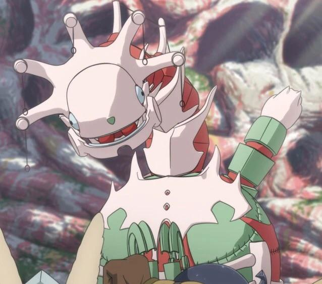

# 🛡️ HADIMAE

<p align="center">
  
</p>
<p align="center">
  
  
  
</p>

> **Backup & Restore Pesan/Media Telegram yang Terhapus (Admin Log)**

---

## ✨ Deskripsi
Script Python untuk:
- 🗃️ **Backup (dump)** pesan & media yang terhapus dari grup Telegram (admin log)
- ♻️ **Restore** pesan & media tersebut ke grup Telegram

Menggunakan library [Telethon](https://github.com/LonamiWebs/Telethon).

---

## 🚀 Fitur
- Backup pesan & media yang terhapus (48 jam terakhir) dari admin log grup
- Restore pesan & media ke grup Telegram

---

## 📝 Syarat & Persiapan
1. **Akun Telegram** (harus admin di grup)
2. **API ID & API Hash** dari [my.telegram.org](https://my.telegram.org/auth)
3. **Group Chat ID** (format: `-100xxxxxxxxxx`)
4. **Python 3.x**
5. **Library Telethon**
   ```bash
   pip install telethon
   ```

---

## ⚡ Cara Penggunaan

### 1. Backup (Dump) Pesan/Media yang Terhapus

- **Edit file `dump_telegram_deleted.py`:**
  ```python
  api_id = 'ISI_API_ID'      # Dapatkan dari https://my.telegram.org, menu API Development Tools
  api_hash = 'ISI_API_HASH'  # Dapatkan dari https://my.telegram.org, menu API Development Tools
  group_chat_id = -1001234567890  # Dapatkan dari bot @userinfobot di Telegram, forward pesan dari grup ke bot ini
  ```
  **Penjelasan:**
  - `api_id` dan `api_hash` didapatkan dengan login ke https://my.telegram.org, pilih API Development Tools, lalu buat aplikasi baru.
  - `group_chat_id` bisa didapatkan dengan menggunakan bot [@userinfobot](https://t.me/userinfobot), forward pesan dari grup ke bot tersebut, nanti akan muncul ID grup (format: -100xxxxxxxxxx).

- **Jalankan script:**
  ```bash
  python dump_telegram_deleted.py
  ```
- Akan dihasilkan file `dump.json` dan file media (jika ada)

### 2. Restore Pesan/Media ke Grup

- **Edit file `restore_telegram_deleted.py`:**
  ```python
  api_id = 'ISI_API_ID'      # Dapatkan dari https://my.telegram.org, menu API Development Tools
  api_hash = 'ISI_API_HASH'  # Dapatkan dari https://my.telegram.org, menu API Development Tools
  chat_id = -1001234567890   # Sama dengan group_chat_id di atas
  ```
  **Penjelasan:**
  - Gunakan nilai `api_id`, `api_hash`, dan `chat_id` yang sama seperti pada langkah backup.

- **Pastikan file `dump.json` ada di folder yang sama**
- **Jalankan script:**
  ```bash
  python restore_telegram_deleted.py
  ```

---

## 📦 Contoh Output

**Saat backup:**
```
Dumping message 0 ( 12345 2024-06-01 10:00:00 )
Dumped media 1
Dumping message 1 ( 12346 2024-06-01 10:01:00 )
...
```

**Saat restore:**
```
12345 Pesan contoh, 2024 Jun 01, 10:00, has_media: True
Sending Media: 12345.jpg
Sending Message: 2024 Jun 01, 10:00\n\nPesan contoh
...
```

---

## ⚠️ Catatan Penting
- Hanya pesan/media yang terhapus dalam **48 jam terakhir** yang bisa di-backup
- Proses restore akan **mengirim ulang** pesan/media ke grup, bukan mengembalikan ke posisi aslinya
- Pastikan format `dump.json` valid (array JSON, tanpa koma di akhir)

---

## 👤 Author
**Dibuat oleh [albelelep](https://github.com/albelelep)**

---

## 📄 Lisensi
MIT 